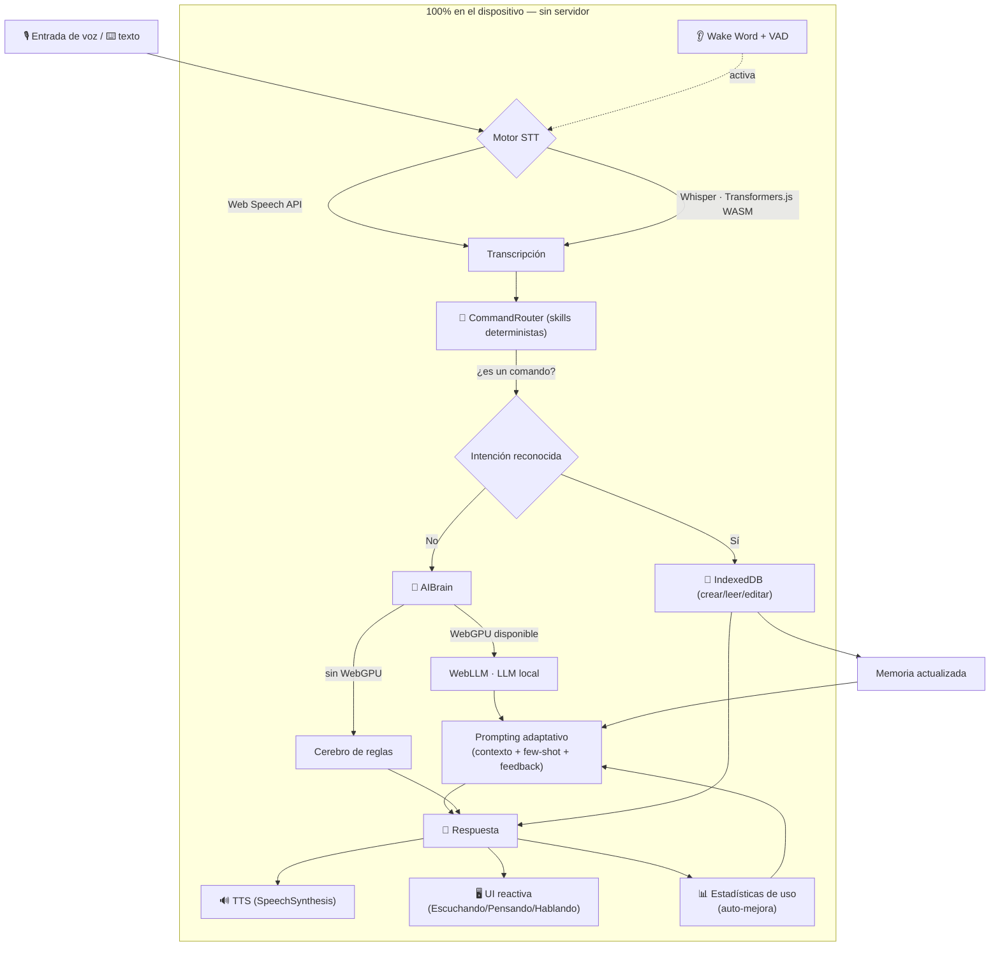

# 🎙️ Asistente de Voz — PWA offline-first con IA en el dispositivo

Asistente virtual **controlado por voz**, empaquetado como **PWA instalable en Android**, que funciona **100 % offline** tras la primera carga y ejecuta la IA **localmente en el cliente** (WebGPU / WebAssembly). Sin servidores, sin costos, sin que tus datos salgan del teléfono.

> Diseño de referencia: arquitectura *offline-first*, *voice-first* y *privacy-first*. Todo el estado del usuario vive en **IndexedDB**; los modelos se cachean en el navegador.

---

## ✨ Características

- **Offline total:** app shell precacheada por un Service Worker; funciona sin conexión.
- **Voz (STT):** Web Speech API nativa (rápida, integrada en Android) con **adaptador Whisper** vía Transformers.js (WASM/ONNX) para mayor precisión.
- **Voz (TTS):** SpeechSynthesis con selección de voz local en español y **voces neuronales Piper offline** (es_ES/es_MX, 63–77 MB por voz en OPFS, gratis) para un habla mucho más natural; la voz del sistema queda como respaldo automático.
- **Wake word / VAD:** palabra de activación por escucha continua + detección de actividad de voz por energía (RMS) para autocortar la grabación.
- **IA local:** LLM en el dispositivo con **WebLLM** sobre **WebGPU** (modelos pequeños: Qwen3/3.5, Gemma 3, Llama 3.2, Phi-4 mini; por defecto **Qwen3 1.7B**). **Cerebro de reglas de respaldo** cuando no hay WebGPU.
- **Memoria persistente:** notas, tareas, eventos, alarmas, historial y preferencias en **IndexedDB**.
- **Auto-mejora:** *few-shot prompting* dinámico que se adapta a los comandos más usados y al feedback (👍/👎).
- **Búsqueda semántica local (RAG):** embeddings multilingües en el dispositivo (Transformers.js + IndexedDB) para encontrar tus notas por significado; los recuerdos relevantes se inyectan al LLM. Panel de "Aprendizaje" y exportar/importar tu memoria.
- **Proactividad:** briefing de agenda al abrir (eventos de hoy, tareas pendientes y choques de horario) y consciencia de batería (contexto para la IA, avisos y confirmación antes de descargas grandes); tono adaptativo según la urgencia del mensaje.
- **Agencia con deep links:** prepara llamadas, WhatsApp/SMS con el mensaje escrito, correos, rutas en Maps, música en YouTube y búsquedas — tú solo confirmas con un toque. Mini‑agenda de contactos local y Contact Picker del sistema como respaldo.
- **Galería con memoria:** toma fotos o videos desde la app, descríbelos con tus palabras y encuéntralos después por significado («muéstrame las fotos del recibo»). Archivos en OPFS, 100 % en tu dispositivo.
- **Skills:** notas, tareas (con prioridad), agenda/eventos y alarmas — por voz o toque.
- **PWA nativa:** `manifest.json` completo con iconos, tema, accesos directos y modo pantalla completa.

---

## 🧭 FASE 1 — Arquitectura y flujo de datos



**Ciclo de vida de una petición:** captura de voz → (wake word/VAD) → transcripción → enrutado de skills → si es comando, se persiste en IndexedDB y se responde; si no, el cerebro (LLM local o reglas) genera respuesta usando un *system prompt* construido dinámicamente con el contexto y los patrones del usuario → la respuesta se muestra y se sintetiza por voz → se registran estadísticas que retroalimentan el prompting.

---

## 📁 FASE 2 — Estructura del repositorio

```
asistente-voz-pwa/
├── index.html                 # App shell (UI móvil, registro del SW)
├── manifest.json              # Configuración PWA (iconos, shortcuts, tema)
├── sw.js                      # Service Worker (estrategias de caché offline)
├── css/
│   └── styles.css             # Estilos (dark, estados del asistente)
├── js/
│   ├── app.js                 # Orquestador (conecta todos los módulos)
│   ├── voice-engine.js        # STT + TTS + VAD + Wake Word
│   ├── ai-brain.js            # WebLLM (WebGPU) + memoria IndexedDB + prompting
│   ├── commands.js            # Router de skills / intenciones (es-ES)
│   └── ui.js                  # Presentación reactiva (burbujas, sheets, listas)
├── assets/
│   └── icons/                 # Iconos PWA (192, 512, maskable, apple-touch)
├── .github/
│   └── workflows/
│       └── deploy.yml         # CI/CD → GitHub Pages (opcional, vía Actions)
├── package.json
├── .gitignore
├── LICENSE
└── README.md
```

**Módulos y responsabilidades**

| Módulo | Rol |
|---|---|
| `voice-engine.js` | Captura de audio, STT (Web Speech/Whisper), TTS, VAD, wake word. API por eventos. |
| `ai-brain.js` | `MemoryStore` (IndexedDB) + `AIBrain` (WebLLM/WebGPU, fallback de reglas, prompting adaptativo). |
| `commands.js` | Interpreta intenciones deterministas (crear/consultar notas, tareas, eventos, alarmas). |
| `ui.js` | Estados visuales, conversación, panel de skills y ajustes. |
| `app.js` | Une todo: flujo voz→skill/IA→voz, alarmas, ajustes, accesos directos. |

---

## 🚀 FASE 5 — Instalación, uso y despliegue

### 1) Clonar y probar en local

La app necesita servirse por **HTTP(S)** (los Service Workers y la voz no funcionan con `file://`).

```bash
git clone https://github.com/<tu-usuario>/asistente-voz-pwa.git
cd asistente-voz-pwa

# Opción A (Node):
npx serve -l 5173 .

# Opción B (Python):
python3 -m http.server 5173
```

Abre `http://localhost:5173`. En escritorio, Chrome permite probar micrófono e instalación.

> **WebGPU** (para el LLM local) requiere Chrome/Edge recientes. **Whisper** y la Web Speech API requieren **contexto seguro** (localhost cuenta como seguro).

### 2) Subir a GitHub

```bash
git init
git add .
git commit -m "feat: asistente de voz PWA offline-first"
git branch -M main
git remote add origin https://github.com/<tu-usuario>/asistente-voz-pwa.git
git push -u origin main
```

### 3) Activar GitHub Pages (despliegue automático)

**Vía A — Deploy from a branch (la activa en este repo):**

1. En GitHub: **Settings → Pages → Build and deployment → Source: Deploy from a branch** → rama `main`, carpeta `/ (root)`.
2. Cada `push` a `main` republica el sitio (~1 min). No requiere workflow ni build.
3. La URL será `https://<tu-usuario>.github.io/asistente-voz-pwa/`.

**Vía B — GitHub Actions:** sube `.github/workflows/deploy.yml` (el push debe hacerse con un token con scope `workflow`) y elige **Source: GitHub Actions**.

> **Alternativa Vercel:** *Import Project* → framework **Other** → sin build command → output `/`. Deploy.

### 4) Instalar la PWA en Android

1. Abre la URL pública (**HTTPS**) en **Chrome** de tu Android.
2. Menú **⋮ → Instalar aplicación / Agregar a pantalla de inicio**.
3. Se instala con icono propio, a pantalla completa. Concede permisos de **micrófono** y **notificaciones** al usarla.
4. La primera carga descarga y cachea la app; luego funciona **offline**. Si activas un modelo de IA, su descarga (~1 GB) también queda cacheada.

---

## 🗣️ Ejemplos de comandos de voz

- «Crea una nota: comprar pan y leche»
- «Agrega tarea urgente enviar el informe»
- «Recuérdame llamar al banco a las 5 de la tarde»
- «Ponme una alarma en 30 minutos»
- «Agenda reunión con el equipo mañana a las 10»
- «¿Qué tareas tengo pendientes?» · «Léeme mis notas» · «¿Qué hay en mi agenda hoy?»
- «Abre mis tareas» · «Marca como hecha comprar pan»
- «Recuerda que el número de mamá es +58 412 123 4567» · «Llama a mamá» · «Escríbele a mamá que llego en 10 minutos»
- «¿Dónde queda la farmacia más cercana?» · «Pon música de salsa» · «Busca en Google el clima de mañana»
- «Toma una foto» · «Muéstrame las fotos del recibo del proveedor»

---

## ⚙️ Configuración (en Ajustes)

- **Motor STT:** Web Speech (nativo) o Whisper (más preciso).
- **Modelo de IA:** elige y descarga un modelo pequeño (según tu hardware).
- **Voz TTS:** selecciona la voz local en español.
- **Palabra de activación:** personalízala (por defecto «asistente»).
- **Aprendizaje:** tono del asistente, comandos más usados, búsqueda semántica (activar/reindexar) y copia de seguridad (exportar/importar).
- **Notificaciones** y **borrado de datos**.

---

## 🔒 Privacidad

Todo el procesamiento ocurre en tu dispositivo. Las notas, tareas y el historial se guardan en **IndexedDB** local; los modelos se cachean en el navegador. **Ningún dato se envía a servidores.** Las únicas descargas son, la primera vez, las librerías desde un CDN y (si lo activas) los pesos del modelo.

---

## 🧩 Notas técnicas y limitaciones

- **Alarmas en segundo plano:** una PWA sin push server solo dispara notificaciones con la app abierta o recién suspendida. Para alarmas con la app cerrada se necesitaría **Web Push + un servidor** (fuera del alcance offline-first). Documentado como mejora futura.
- **Wake word:** implementado con reconocimiento continuo de Web Speech; es práctico pero consume batería y depende del navegador. Para producción intensiva, considerar un wake-word neuronal (p. ej. Porcupine) vía WASM.
- **Modelos grandes (8B):** no recomendados en móvil (RAM/almacenamiento). Por defecto se usan modelos de 0.5B–2B.
- **iOS:** soporte de Web Speech y WebGPU más limitado que en Android/Chrome.

---

## 🤝 FASE — Cómo contribuir

1. Haz un *fork* y crea una rama: `git checkout -b feature/mi-mejora`.
2. Mantén el estilo: JavaScript modular (ES Modules), sin framework, comentado en español.
3. Prueba en local con `npx serve` antes de abrir el PR.
4. Abre un *Pull Request* describiendo el cambio. Ideas bienvenidas: nuevas *skills*, más idiomas, wake word neuronal, sincronización opcional cifrada.

---

## 📜 Licencia

MIT © 2026 Moises. Ver [LICENSE](./LICENSE).
